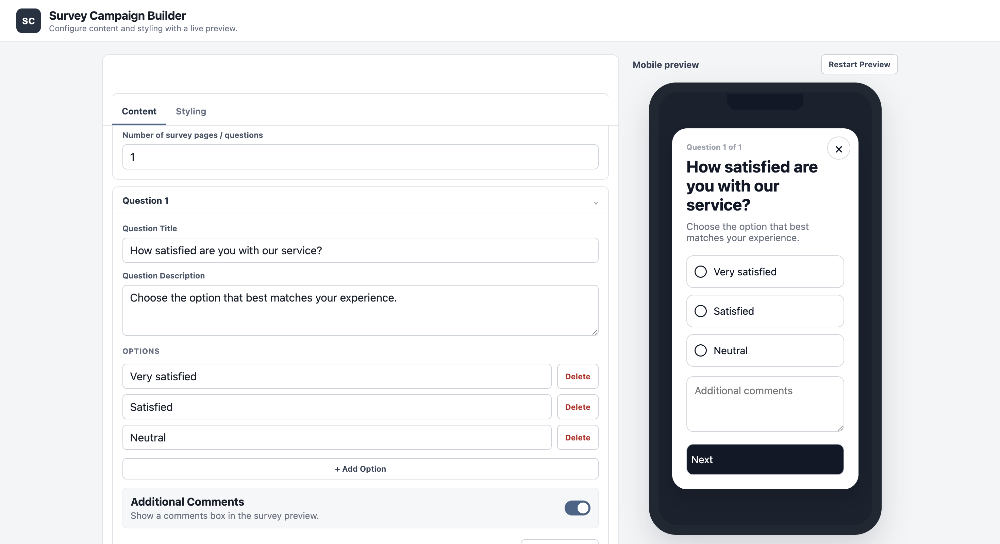
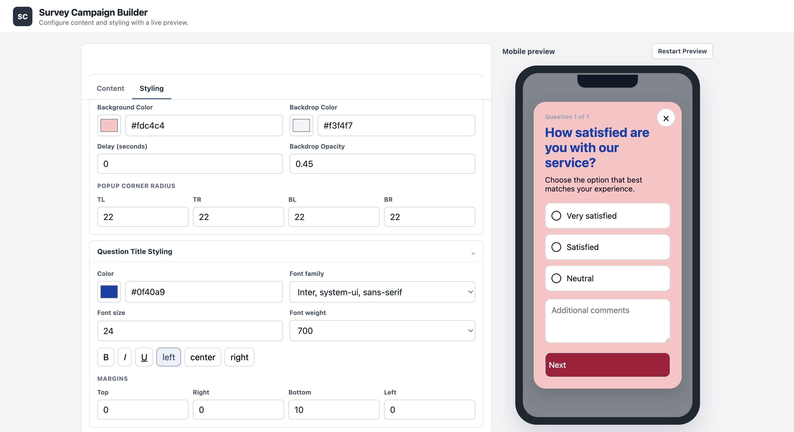
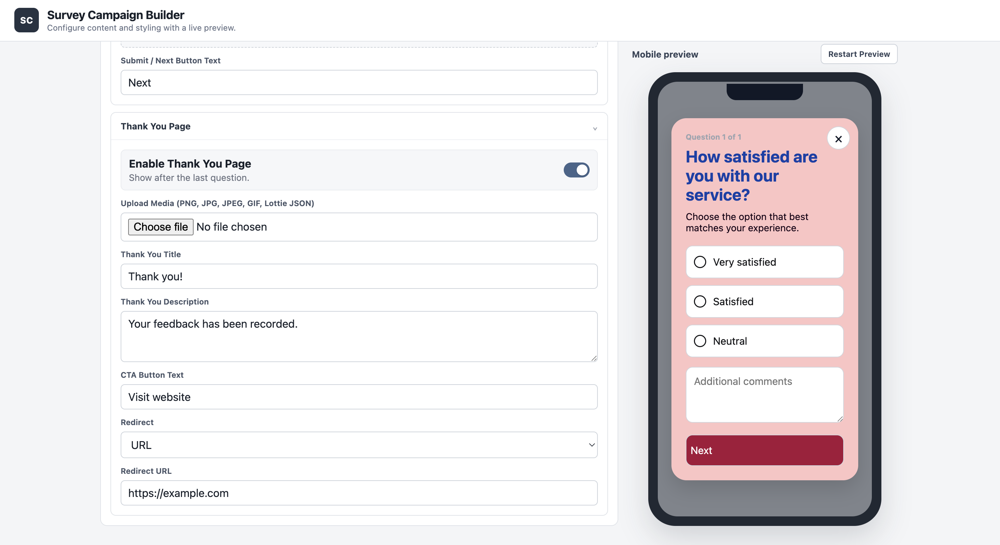

# Survey Campaign Builder

[](https://github.com/SintuMishra/survey-campaign-builder/actions/workflows/ci.yml)

A configurable survey campaign builder built with React, TypeScript, and Vite. It provides content, conditional-flow, media, and visual styling controls alongside a real-time mobile preview.

### Live Demo

- Live Application: https://survey-campaign-builder-eight.vercel.app/
- GitHub Repository: https://github.com/SintuMishra/survey-campaign-builder

---

## Overview

Survey Campaign Builder is a frontend product-engineering project focused on interactive configuration and immediate visual feedback.

Users can define survey questions, options, branching conditions, Thank You behavior, media, and presentation styles while seeing changes reflected instantly inside a mobile survey preview.

The application uses typed configuration models and centralized React state so the content editor, styling editor, and preview stay synchronized without requiring a separate save or refresh step.

---

## Key Features

### Campaign Content

- Configure between 1 and 20 survey questions
- Edit question titles and descriptions
- Dynamically add and remove answer options
- Enforce a minimum of two options per question
- Enable optional additional-comments fields
- Customize Submit / Next button text
- Configure an optional Thank You page
- Configure external URL redirects

### Conditional Survey Flow

- Add conditions to individual questions
- Trigger branching based on selected answers
- Redirect to another survey question
- Redirect directly to the Thank You page
- Automatically remove invalid conditions when their associated option is deleted

### Live Styling

The builder provides configuration controls for:

- Survey background and backdrop
- Backdrop opacity
- Popup corner radius
- Question title typography
- Subtitle typography
- Selected and unselected option styling
- Radio, checkbox, filled, and alternative option layouts
- Option spacing and dimensions
- Additional-comments field styling
- CTA button dimensions, typography, colors, and radius
- Close-button appearance and custom icon
- Thank You title, subtitle, media, and button styling

### Media Support

The Thank You page supports:

- PNG
- JPG / JPEG
- GIF
- Lottie JSON animations

Lottie animations are rendered using the lightweight `lottie-web` player with failure handling for invalid animation data.

### Interactive Mobile Preview

The built-in preview supports:

- Real-time content updates
- Real-time styling updates
- Question progress
- Single-choice interaction
- Multi-select checkbox interaction
- Conditional navigation
- Additional comments
- Thank You flow
- External redirect actions
- Close and reopen behavior
- Configurable preview restart delay

---

## Screenshots

### Content Configuration



### Live Styling



### Thank You Configuration



---

## Tech Stack

| Area | Technology |
| --- | --- |
| UI | React 18 |
| Language | TypeScript |
| Build Tool | Vite |
| State Management | React Context + `useReducer` |
| Animation | `lottie-web` |
| Styling | CSS |
| Deployment | Vercel |
| CI | GitHub Actions |

---

## Architecture

The application is organized around a shared typed campaign configuration.

`CampaignProvider` owns campaign state through React Context and `useReducer`. The Content and Styling editors update this central state, while the mobile preview consumes the same configuration directly.

This creates a predictable one-directional data flow:

```text
Content Editor ──────┐
                     │
Styling Editor ──────┼──> Campaign Context ───> Mobile Preview
                     │
Default Campaign ────┘
```

This architecture keeps survey content, visual configuration, and preview behavior synchronized through a single source of truth.

---

## Project Structure

```text
survey-campaign-builder/
├── .github/
│   └── workflows/
│       └── ci.yml
├── screenshots/
│   ├── survey-builder-content.png
│   ├── survey-builder-styling.png
│   └── survey-builder-preview.png
├── src/
│   ├── components/
│   │   ├── content/
│   │   ├── layout/
│   │   ├── preview/
│   │   ├── styling/
│   │   └── ui/
│   ├── context/
│   ├── data/
│   ├── types/
│   ├── utils/
│   ├── App.tsx
│   └── main.tsx
├── package.json
├── tsconfig.json
└── vite.config.ts
```

---

## Local Development

### Requirements

- Node.js 22+
- npm

### Clone and install

```bash
git clone https://github.com/SintuMishra/survey-campaign-builder.git
cd survey-campaign-builder
npm ci
```

### Start development server

```bash
npm run dev
```

### Create production build

```bash
npm run build
```

### Preview production build

```bash
npm run preview
```

---

## Continuous Integration

GitHub Actions automatically validates pushes and pull requests targeting the `main` branch.

The CI workflow:

1. Checks out the repository
2. Configures Node.js 22
3. Installs locked dependencies with `npm ci`
4. Runs the TypeScript and Vite production build

This provides automated verification that the application continues to compile successfully as the project evolves.

---

## Deployment

The application is deployed on Vercel as a static Vite frontend.

**Live application:** https://survey-campaign-builder-eight.vercel.app/

The current architecture is frontend-only and does not require a backend service or database.

---

## Engineering Focus

This project demonstrates practical frontend product engineering through:

- Typed frontend domain modeling with TypeScript
- React Context and reducer-based state management
- Dynamic survey and option configuration
- Conditional question navigation
- Multi-select and single-select interactions
- Real-time content and styling synchronization
- Configurable Thank You experiences
- Reusable visual styling controls
- Image, GIF, and Lottie animation handling
- Responsive mobile preview behavior
- Component-oriented React architecture
- Automated production-build verification with GitHub Actions

---

## Author

**Sintu Mishra**

Software Engineer — Backend, Systems & Robotics

- GitHub: https://github.com/SintuMishra
- LinkedIn: https://www.linkedin.com/in/sintu-mishra-3o11/
- Portfolio: https://portfolio-flame-six-93wdoxmah1.vercel.app/
